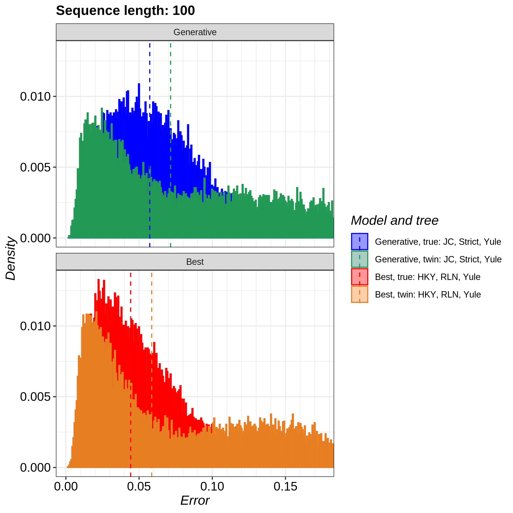
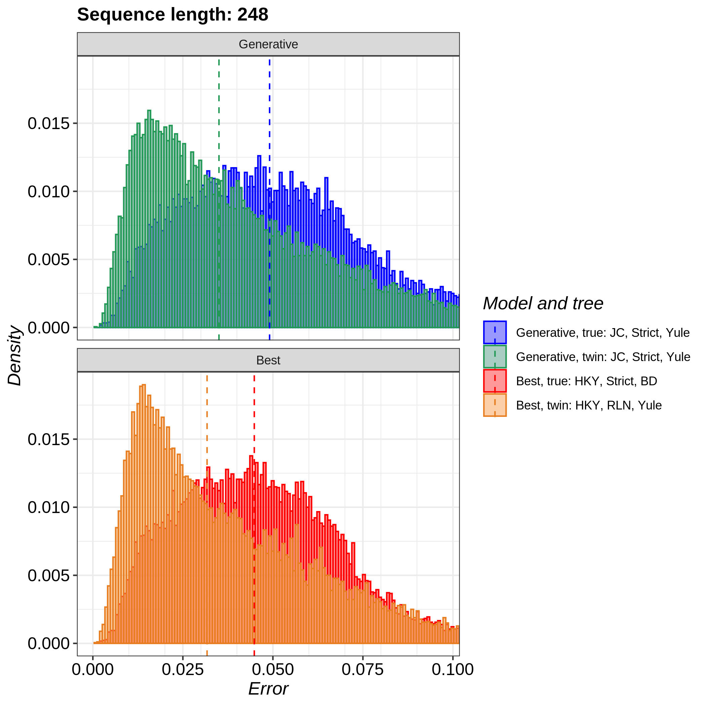
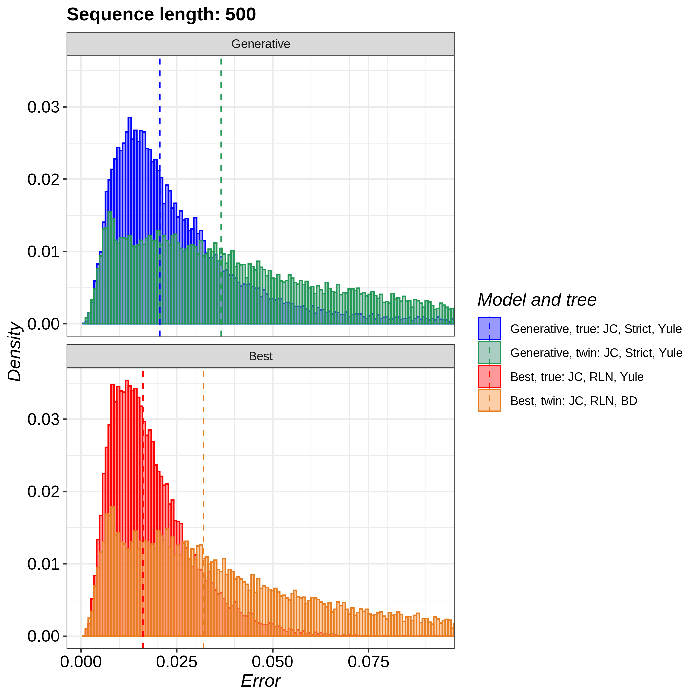
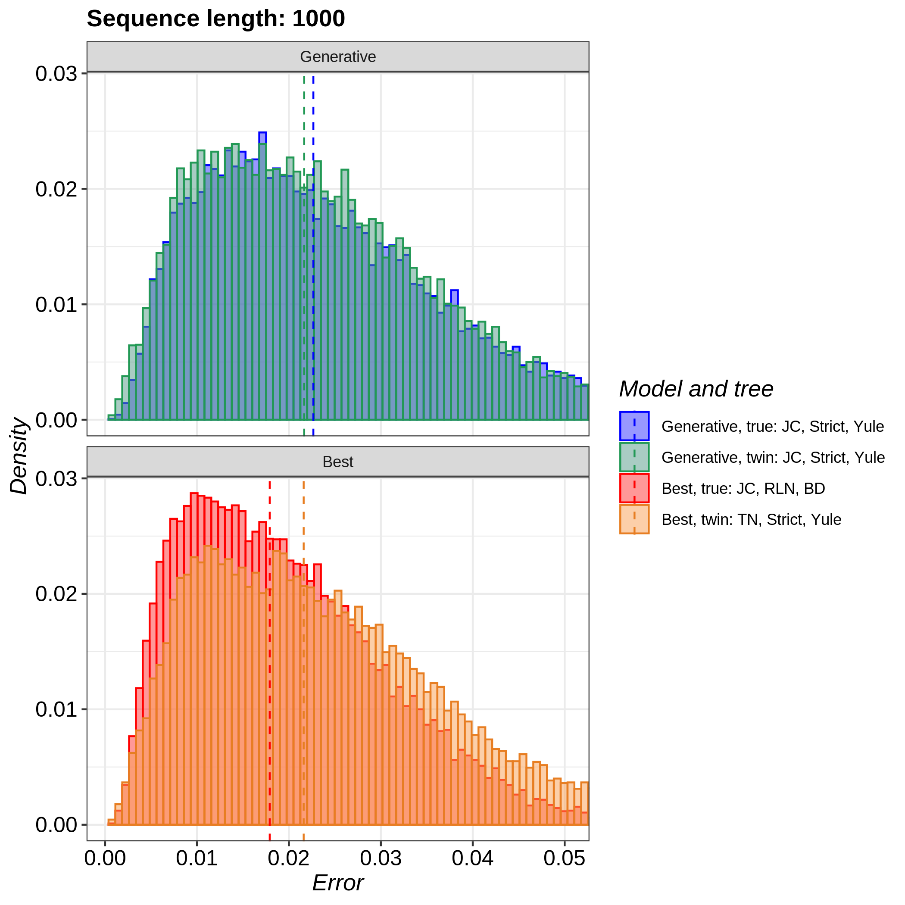
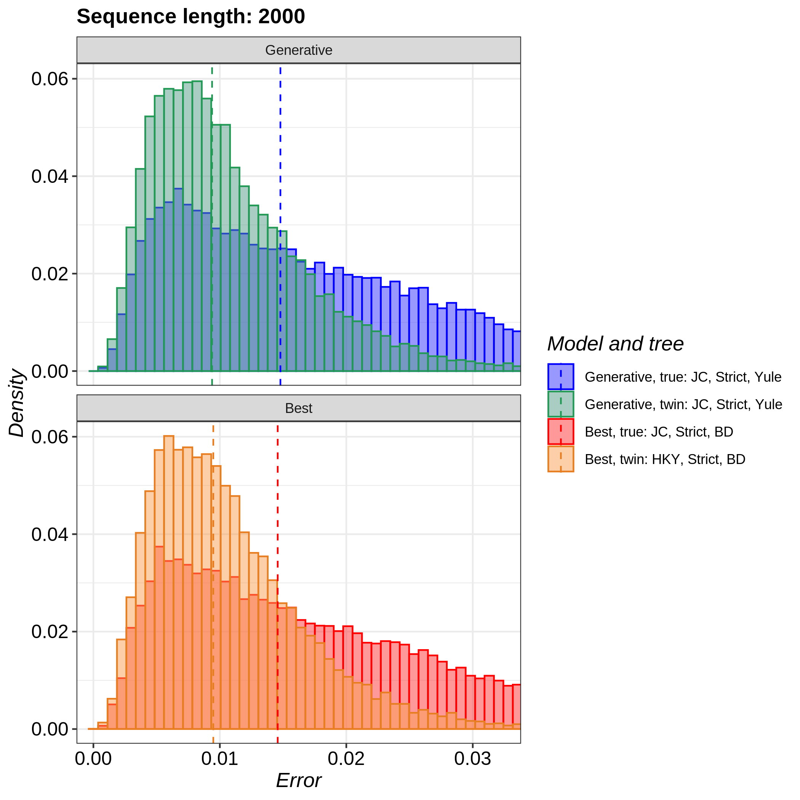
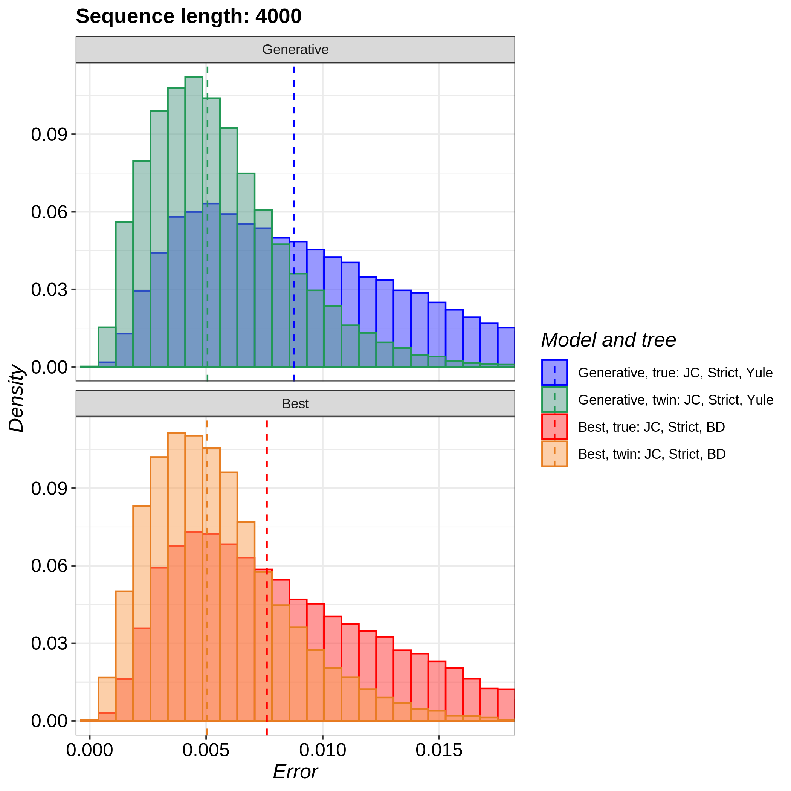
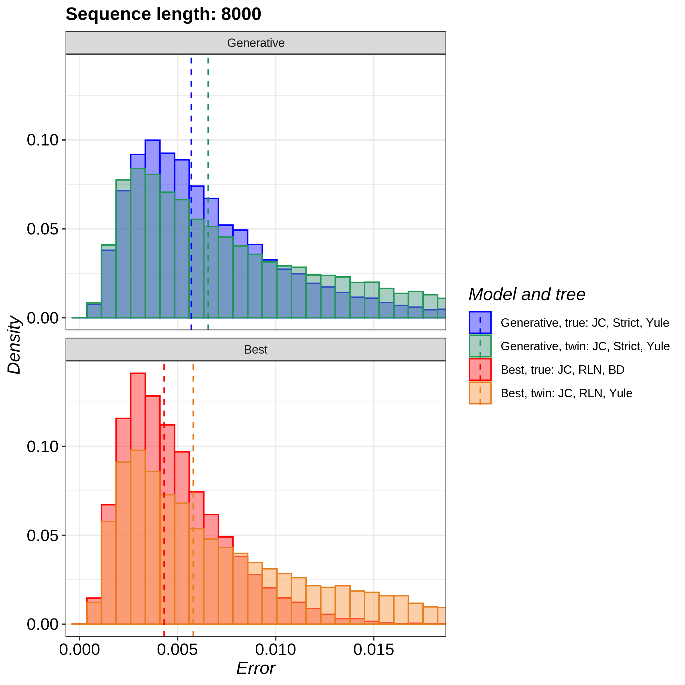
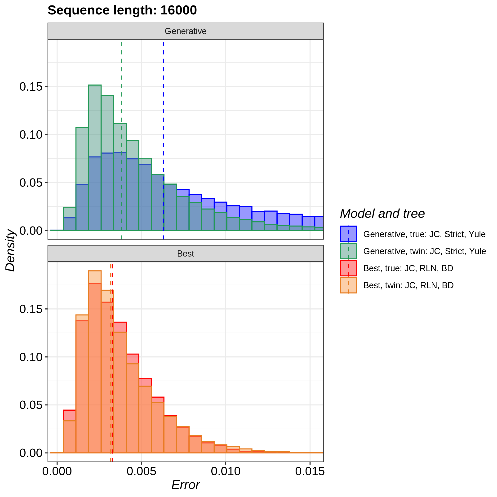

# pirouette_example_21

Branch   |                                                                                                 |                                                                                               
---------|--------------------------------------------------------------------------------------------------------------------------------------------------------------|--------------------------------------------------------------------------------------------------------------------------------------------------------------------------------------------
`master` | |
`develop`||

A [pirouette example](https://github.com/richelbilderbeek/pirouette_examples)
that shows the true and twin error for 10, 1k, 2k, ..., 10k nucleotides.

## Results

100 nucleotides:

248 nucleotides:

500 nucleotides:

1000 nucleotides:

2000 nucleotides:

4000 nucleotides:

8000 nucleotides:

16000 nucleotides:

